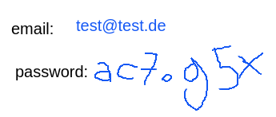

# Clockwork Clementine

Clockwork Clementine is an event management system developed as part of a full-stack training program. While combining both backend and frontend technologies, its focus is clearly on the backend.

The main goal was to create a seamless user experience for managing events inside multiple calendars. In addition to basic features such as setting up a server, managing database connections and integrating a frontend interface, the project also includes several advanced features, such as user authentication, cookie management, error handling and data validation.

## Technologies Used

- **Backend:** Node.js, Express, MongoDB, Mongoose, JWT
- **Frontend:** React with Vite, React Big Calendar
- **Styling:** Native CSS

## Features

- **CRUD Operations:** Full implementation of Create, Read, Update, and Delete operations for events and calendars.
- **Multi-Calendar Management:** Ability to manage multiple calendars simultaneously in one integrated view.
- **User Authentication with cookies:** Secure user authentication using Jason Web Token (JWT) and cookies.
- **Data Validation:** Strong data validation and sanitization to ensure data integrity.
- **Error Handling:** Error handling middleware, with important error messages being transferred to the frontend.
- **Fully Responsive Design**

## Preview


## Database Relations

Three mongoose collections are in use (users, calendars and events). This made it necessary to populate data and manage all collections effectively. The following image illustrates these interdependencies between users, calendars and events.


## Deployed Website

Take a look at the deployed website here: [ClockworkClementine.onrender.com](https://ClockworkClementine.onrender.com/)

### Important Notice

**Registration and login will only work if you enable third-party cookies!** If your browser usually blocks those, please make sure to change the settings before accessing the website.

For instance, in Google Chrome:

1. Go to `Settings`
2. Navigate to `Privacy and security`
3. Click on `Third party cookies`
4. Choose the option `Allow third-party cookies`

### Pre-configured login data

For demonstrational purposes, registration is also possible with a non-existing (fictive) email address. If you do not want to register at all, you may simply use the following login data:



## Installation and Local Usage

To run the app locally on your device, follow these steps:

1. **Clone the Repository and navigate to the project directory:**

   ```bash
   git clone git@github.com:username/repository.git
   cd repository
   ```

2. **Install Dependencies and Start the Server and Client**
   Install npm (node package manager) if necessary. Then, run the following pre-configured command that will install the required packages and start the server and the client:

   ```javascript
    npm run startLocally
   ```

3. **Access the application:**
   In your browser, go to `http://localhost:5173/` (or simply follow the link provided in your terminal) to access the application.
